# How-to-Build-a-Graph-Based-Deep-Learning-Architecture-in-Traffic-Domain
Paper：[How to Build a Graph-Based Deep Learning Architecture in Traffic Domain: A Survey](https://arxiv.org/pdf/2005.11691.pdf)

# mind map

# Abstract

深度学习在计算机视觉和自然语言处理方面的巨大成功启发了研究人员在交通领域中利用深度学习技术。已经提出了各种深度学习架构来解决交通领域中的复杂挑战（例如，空间时间依赖性）。此外，研究人员传统上将交通网络建模为空间维度上的网格或分段。但是，许多交通网络本质上都是图结构的。为了充分利用此类空间信息，更合适的方法是将交通网络数学化为图形。最近，已经开发了许多新颖的深度学习技术来处理图形数据。越来越多的作品将这些基于图的深度学习技术应用于各种交通任务，并获得了最先进的性能。为了提供这种新兴趋势的全面清晰的描述，本次调查仔细检查了许多交通应用中各种基于图的深度学习架构。我们首先给出指导方针，以基于图来制定交通问题，并根据各种交通数据构建图。然后，我们分解这些基于图的体系结构，并讨论它们共享的深度学习技术，以阐明每种技术在交通任务中的利用。此外，我们总结了常见的流量挑战以及针对每个挑战的相应的基于图的深度学习解决方案。最后，我们在这个快速发展的领域中提供基准数据集，开源代码和未来的研究方向。

# Introduction

在许多国家和地区，随着城市化进程的不断扩大，大量人口迅速聚集到城市中。这些城市中私家车数量的快速增长和对公共交通服务的需求不断增长，给它们当前的交通系统带来了巨大压力。频繁的交通拥堵，严重的交通事故，长时间的通勤等交通问题严重恶化了旅客的出行体验，降低了城市的运营效率。为了应对这些挑战，许多城市致力于开发智能交通系统（ITS），以提供有效的交通管理，准确的交通资源分配和高质量的交通服务。ITS还旨在减少事故的可能性，缓解交通拥堵并确保公共交通安全。

要构建使城市变得智能的智能交通系统，主要有两个必不可少的要素，即智能基础设施和新算法。

一方面，随着对交通基础设施投资的增加，交通设备和系统越来越多，包括环路探测器，探头，道路网络上的公路摄像机，出租车或公共汽车上的GPS，地铁和公共汽车上的智能卡，自动收费系统，在线乘车或乘车共享系统。这些基础设施是异构数据源，并全天候产生交通数据，例如数字数据（例如GPS轨迹，交通测量），图像/视频数据（例如车辆图像）和文本数据（例如事件报告）。这些运输数据量巨大，细节丰富，结构复杂。迫切需要利用更智能，更强大的方法来处理这些数据。

另一方面，在交通领域，研究人员目睹了从统计方法到机器学习模型以及最近到深度学习方法的进化算法。在早期，包括ARIMA [1]及其变体[2]，VAR [3]，卡尔曼滤波[4]在内的统计方法因其扎实且被广泛接受的数学基础而盛行。但是，这些方法的线性和平稳性假设被交通数据中的高度非线性和动态性所破坏，因此在实践中表现不佳。传统的机器学习方法（例如支持向量机[5]，K最近邻[6]）可以对交通数据中的非线性和更复杂的相关性进行建模。然而，在大数据场景中，这些模型中的浅层架构，手动特征选择和单独学习被认为是不令人满意的[7]。

深度学习在计算机视觉，自然语言处理等许多领域的突破引起了交通行业和研究界的关注。深度学习技术通过提供原始流量数据的端到端学习，克服了手工制作的特征工程。理论上，深度学习方法具有逼近任何复杂功能的强大功能，可以在各种交通网络中对更复杂的模式进行建模。另外，由于可用的计算资源（例如GPU）和足够的交通数据量[7]，基于深度学习的技术已被广泛采用，并在多种交通应用中实现了最先进的性能。递归神经网络（RNN）及其变体被广泛用于处理序列数据，并且具有提取交通数据中时间相关性的出色能力[8]。但是，它们无法提取交通网络的空间特征。卷积神经网络（CNN）是在基于网格的交通网络中建模空间依赖性的强大方法[9]。然而，许多交通数据自然是基于图形的数据。更糟糕的是，CNN专注于提取局部相关性，而忽略整个网络的全局连接。另外，尽管一些先前的工作已经在图形视图中分析了交通问题[10]，[11]，[12]，但是这些传统方法还不足以处理大数据并解决复杂的挑战。

最近，许多研究扩展了对图数据的深度学习方法[13]，并提出了一组称为图神经网络（GNN）的神经网络[14]，[15]，[16]，旨在解决与图相关的应用。GNN已成为许多领域的最新方法，包括自然语言处理[17]，计算机视觉[18]，生物学[19]，推荐系统[20]。由于许多交通数据都是图结构的，因此在交通领域中探索热门和有效的GNN可以提高预测准确性是很自然的。在过去的几年中，已经制作了许多作品，并且还有更多作品正在路上。在这种情况下，在运输领域对这些基于图的深度学习体系结构进行全面的文献综述是非常及时的，这正是我们的工作。

据我们所知，这是第一篇针对流量领域基于图的深度学习作品进行全面调查的论文。请注意，我们审查的某些作品实际上是使用相似技术解决相似交通问题的。我们的总结可以帮助即将来临的研究人员避免重复的工作，而专注于新的解决方案。此外，本次调查中实用且明确的指南使参与者可以将这些新兴方法快速应用于现实交通任务中。

总而言之，我们做出了如下重要贡献：

- 我们系统地概述了一些交通问题，相关的研究方向和挑战，以概述交通领域，从而帮助参与者找到或扩展他们的研究。
- 我们总结了时空交通问题的一般表述，并为构建四种原始交通数据集的图提供了具体的指导。如此全面的总结非常实用，可以加速基于图的方法在流量域中的应用。
- 我们分析了五种深度学习技术（例如GNN），这些技术广泛用于基于图的交通工作中。我们简要介绍了这些技术的理论方面，优势，局限性，并在特定的交通任务中详细阐述了它们的变体，以期激发以下研究人员开发更多新颖的模型。
- 我们详细讨论了许多基于图结构的交通任务面临的四个常见挑战。对于每个挑战，我们总结了多个基于深度学习的解决方案并进行必要的比较，这对于交通任务中的模型选择可能是有用的建议。
- 我们在相关论文中收集基准数据集和开放源代码，以促进该领域的基准实验。最后，我们提出了未来的研究方向。

本文的其余部分安排如下。第2节介绍了流量领域的其他调查以及有关图神经网络的一些概述。第3节介绍了一些交通问题以及相应的研究方向，挑战。第4节总结了有关交通问题和交通数据集的图形构造。第5节分析了GNN和其他深度学习技术的核心功能，优点和缺点，并研究了为特定交通任务创建这些技术的新颖变体的技巧。第6节讨论了流量域中的常见挑战以及相应的多种解决方案。第7节提供了相关研究论文中开放代码和数据集的超链接。第8节介绍了未来的方向。第9节总结了论文。

# Related Work

已经有一些调查从不同的角度总结了流量域中不断发展的算法。[21]讨论了统计方法和神经网络之间的异同，以促进这两个社区之间的理解。[22]回顾了短期交通预测的十大挑战，这些挑战源于ITS应用需求的变化。[23]对城市流量预测的方法进行了全面的概述。[7]基于深度学习（DL）提供了城市大数据融合方法的分类：基于DL输出的融合，基于DL输入的融合和基于DL双阶段的融合。[24]，[25]讨论了针对热门主题的深度学习，包括交通网络表示，交通流量预测，交通信号控制，自动车辆检测。[26]和[27]对多种交通应用中新兴的深度学习模型进行了类似但更详尽的分析。[28]提供了一个时空视角来总结交通领域和其他领域的深度学习技术。但是，所有这些调查都没有考虑图神经网络（GNN）的相关文献，只是[28]只是在很短的小节中提到了GNN。

另一方面，也有一些评论总结了w.r.t.GNN在不同方面。[29]率先概述了在非欧几里德空间中处理数据（例如图形数据）的深度学习技术。[30]按图类型，传播类型和训练类型对GNN进行了分类，并将相关应用分为结构方案，非结构方案和其他方案。[31]分别介绍了基于小图和巨图的GNN。[32]，[31]集中于审查GNN特定分支（即图卷积网络（GCN））中的相关工作。但是，他们很少介绍与交通场景相关的GNN。[33]是唯一花费一个段落描述流量域GNN的调查，对于任何想要探索该领域的人来说，这显然是不够的。

到目前为止，仍然缺乏系统的，详尽的调查来探索交通领域中发展迅速的基于图的深度学习技术。我们的工作旨在填补这一空白，以增进对交通运输界新兴技术的理解。

# Problems, Research Directions and Challenges

在本节中，我们简要介绍交通领域的背景知识，包括一些重要的交通问题和研究方向（如图1所示），以及在这些问题下的常见挑战。一方面，我们认为，如此简洁而系统的介绍可以帮助读者快速理解这一领域。另一方面，我们的调查显示，与基于图的深度学习技术相关的现有作品仅涵盖了一些研究方向，这激发了后继者将类似技术转移到其余方向。

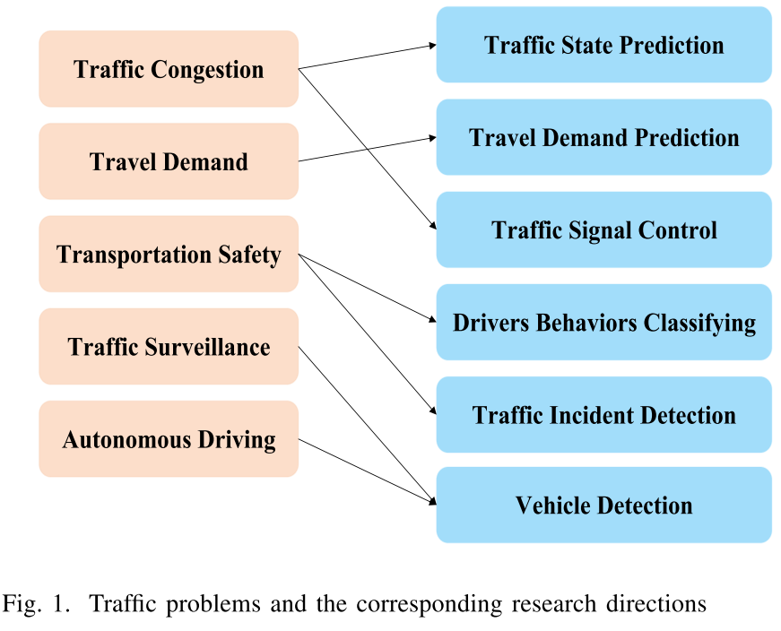

## Traffic Problems

运输社区打算解决许多问题，包括缓解交通拥堵，满足旅行需求，加强交通管理，确保运输安全，实现自动驾驶。每个问题都可以分为几个研究方向，而某些方向可以解决多个问题。我们将介绍这些问题及其研究方向。

### Traffic Congestion

交通拥挤[34]是现代城市中最重要，最紧迫的问题之一。扩展道路基础设施的解决方案非常昂贵且耗时。更实际的方法是提高交通效率，例如，预测道路网络上的交通拥堵[35]，[36]，通过交通状态预测[37]，[18]控制路况，优化车辆通过控制交通信号[38]，[39]来优化及通流量。

### Travel Demand

出行需求是指市民对交通服务（出租车，自行车，公共交通工具）的需求。随着在线乘车平台（例如Uber，DiDi）的出现以及公共交通系统（例如地铁系统和公共汽车系统）的快速发展，从许多角度来看，旅行需求预测变得越来越重要。对于相关机构来说，它可以帮助更好地分配资源，例如在高峰时段增加地铁频率，为服务热点增加更多公交车。对于商业部门，它使他们能够更好地管理出租车出租[40]，拼车[41]，自行车共享服务[42]，[43]，并最大限度地提高收入。对于个人，它鼓励用户考虑各种交通工具，以减少通勤时间并改善出行体验。

### Transportation Safety

运输安全是公共安全必不可少的部分。交通事故会造成长时间的延误，并造成受害者受伤甚至死亡。因此，监控交通事故和评估交通风险对于避免财产损失和挽救生命至关重要。许多研究关注方向，例如检测交通事故[44]，根据社交媒体数据预测交通事故[45]，预测其风险水平[46]，预测交通事故的伤害严重程度[47]，[48]。

### Traffic Surveillance

如今，监视摄像机已广泛部署在城市道路上，生成大量图像和视频[27]。这种发展增强了交通监控，其中包括交通执法，自动收费系统[49]和交通监控系统。交通监控的研究方向包括车牌检测，自动车辆检测[50]，行人检测[51]。5）

### Autonomous Driving

自动驾驶是代表未来的关键新兴产业。自主驾驶要求以平稳准确的方式识别树木，道路和行人。许多任务与视觉识别有关。自动驾驶的研究方向包括车道和车辆检测[52]，[53]，行人检测[54]，交通标志检测。

## Research Directions

我们对交通领域基于图的深度学习的调查显示，现有工作主要集中在两个方向，即交通状态预测，乘客需求预测，还有一些工作集中在驾驶员行为分类[55]，最佳DETC方案[49]，车辆/人员轨迹预测[56]，[57]，路径可用性[58]，交通信号控制[59]。据我们所知，尚未基于图形视图探索交通事故检测和车辆检测

### Traffic State Prediction

文献中的交通状态是指交通流量，交通速度，出行时间，交通密度等。交通流量预测（TFP）[60]，[61]，交通速度预测（TSP）[62]，[63]，行驶时间预测（TTP）[64]，[65]是交通状态预测的热门分支，其中吸引了深入的研究。

### Travel Demand Prediction

出行需求预测旨在估计需要交通服务的用户的未来数量，例如，预测城市每个区域的未来出租车需求[66]，[67]或预测地铁系统中车站级别的乘客需求[68]，[69]，或预测全市的自行车租赁需求[42]，[43]。

### Traffic Signal Control

从长远来看，交通信号灯控制应适当地控制交通信号灯，以减少车辆在十字路口的停留时间[25]。交通信号控制[59]可以优化交通流量并减少交通拥堵和排放。

### Drivers Behaviors Classifying

随着车载传感器和GPS数据的可用性，对驾驶员的驾驶方式进行自动分类是一个有趣的研究问题。驾驶特征的高维度表示有望为自动驾驶和汽车保险行业带来更高收益。

### Traffic Incident Detection

重大事件可能会对旅行者造成致命伤害，并导致道路网络长时间延误。因此，了解事故的主要原因及其对交通网络的影响对于现代交通管理系统至关重要[44]。

### Vehicle Detection

自动车辆检测旨在处理从固定摄像机在道路上记录的视频，然后将视频传输到监视中心进行记录和处理。

## Challenge

尽管交通问题及其研究方向是多种多样的，但它们也面临一些共同的挑战，即空间依赖性，时间依赖性和外部因素。

例如，在早上高峰时间主要道路上发生交通拥堵时，交通流量将在接下来的几个小时改变。而且，其相邻道路可能很快就会出现交通阻塞[70]，[71]，[72]。在车辆轨迹预测中，周围车辆的随机行为，邻居的相对位置以及自身轨迹的历史信息是影响预测性能的因素[56]。在预测某个地区的乘车需求时，其先前的订单对于预测至关重要。另外，共享相似功能的区域可能会在出租车需求中共享相似模式[73]，[66]，[67]。为了预测交通信号，要考虑道路网络上多个路口的几何特征以及之前的交通流量[59]。

为了解决上述挑战，许多作品提供了各种解决方案，这些解决方案可以分为统计方法，传统机器学习方法，深度学习技术。在本文中，我们专注于流量领域的深度学习技术。与之前的深度学习相关流量调查不同，我们对如何构建基于图的深度学习架构以克服各种任务中的挑战感兴趣。我们研究了相关交通工作提供的许多基于图的解决方案，并总结了解决上述挑战的通用技术（如图2所示）。

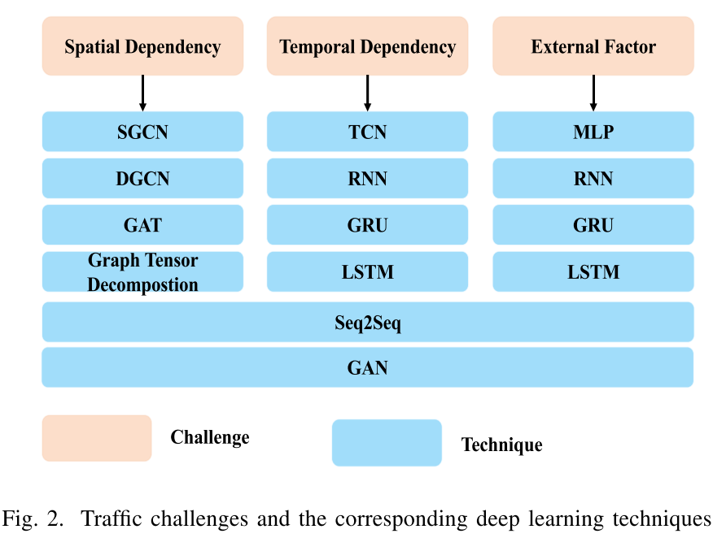

在以下各节中，我们首先介绍解决交通问题的常用方法，并提供详细的准则，以根据交通数据构建交通图。然后，我们从两个角度（即技术角度和挑战角度）阐明挑战与技术之间的相关性。在技术角度，我们介绍了几种常用技术，并解释了它们如何应对交通任务中的挑战。从挑战的角度出发，我们详细阐述了每个挑战，并总结了可以解决该挑战的技术。总之，我们希望结合深度学习技术从图的视角提供解决交通问题的见解。

# Problem Formulation and Graph Construction

在我们研究的基于图的深度学习交通文献中，超过80％的任务本质上是基于图的空间时间预测问题，尤其是交通状态预测，旅行需求预测。在本节中，我们首先列出常用的符号。然后，我们总结了交通领域中基于图的时空预测的一般表述，并提供了从各种交通数据集构建图的细节。最后，我们讨论邻接矩阵的多种定义，它们代表了交通网络的图拓扑，并且是基于图的解决方案的关键要素。

## Notations

在本文中，我们表示了图相关的元素，变量，参数（超参数或训练参数），激活函数和其他操作。变量由输入变量$\{x, X, \mathbf{x}, \mathbf{X}, \mathcal{X}\}$和输出变量组成$\{y, Y, \mathbf{y}, \mathbf{Y}, \mathcal{Y}\}$。这些变量可以分为三类。第一组由仅代表空间属性的空间变量组成。第二组由仅代表时间属性的时间变量组成。最后一组由代表空间和时间特征的时空变量组成。

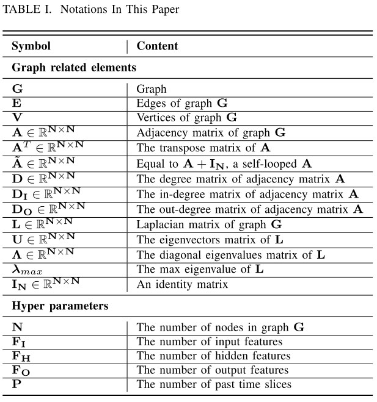

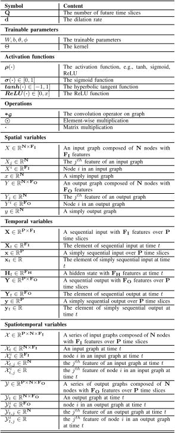

## Graph-based Spatial Temporal Forecasting To

据我们所知，大多数现有的基于图的深度学习交通工作可以归类为空间时间预测。尽管数学符号不同，但他们以非常相似的方式形式化了他们的预测问题。我们总结了他们的工作，为交通领域中许多基于图的时空问题提供了一般的表述。
交通网络用图形$G=(V,E,A)$表示，可以按有针对性地加权[74]，[64]，[60]或不加权[58]，[70]，[75], 有向图[58]，[76]，[77]或无向图[74]，[61]，[78]，具体取决于具体任务。$V$是一组节点，$|V|= N$表示图中的$N$个节点。每个节点代表一个交通对象，可以是传感器[62]，[61]，[79]，路段[74]，[80]，[81]，路口[64]，[76]，甚至是GPS交叉路口[60]。$E$是一组边，表示节点之间的连接性。

$\mathbf{A}=\left(\mathbf{a}_{i j}\right)_{\mathbf{N} \times \mathbf{N}} \in \mathbb{R}^{\mathbf{N} \times \mathbf{N}}$是包含交通网络拓扑信息的邻接矩阵，对交通预测很有用。矩阵$A$中的项$a_{ij}$表示节点接近度，并且在各种应用程序中有所不同。它可以是二进制值0或1 [61]，[70]，[75]。具体而言，0表示节点$i$和节点$j$之间没有边缘，而1表示这两个节点之间的边缘。它也可以是表示节点[74]，[73]之间某种关系的浮点值，例如，两个传感器[62]，[82]，[77]之间的道路距离。

$\mathcal{X}_{t}=\left[\mathcal{X}_{t}^{1}, \cdots, \mathcal{X}_{t}^{i}, \cdots, \mathcal{X}_{t}^{\mathrm{N}}\right] \in \mathbb{R}^{\mathrm{N} \times \mathbf{F}_{\mathrm{I}}}$是时刻$t$整个图的特征矩阵。$X_i^t \in R^{F_I}$表示在时间$t$具有$F_I$特征的节点$i$。这些功能通常是交通指标，例如交通流量[78]，[77]，交通速度[62]，[80]，[76]或rail-hail orders[74]，[73]，客流[68]]，[69]。通常，连续指标会在数据预处理阶段进行标准化。

给定整个过去P个时间段内的交通网络的历史观测值，表示为$\left[\mathcal{X}_{1}, \cdots, \mathcal{X}_{i}, \cdots, \mathcal{X}_{\mathbf{P}}\right] \in \mathbb{R}^{\mathbf{P} \times \mathbf{N} \times \mathbf{F}_{\mathbf{I}}}$，交通领域的时空预测问题旨在预测下一个Q时间片的未来交通情况，表示为$\mathcal{Y}=\left[\mathcal{Y}_{1}, \ldots, \mathcal{Y}_{i}, \ldots, \mathcal{Y}_{\mathrm{Q}}\right] \in \mathbb{R}^{\mathrm{Q} \times \mathrm{N} \times \mathrm{F}_{\mathrm{O}}}$，其中$\mathcal{Y}_t \in \mathbb{R}^{N \times F_o}$表示在时间$t$具有$F_O$特征的输出图。

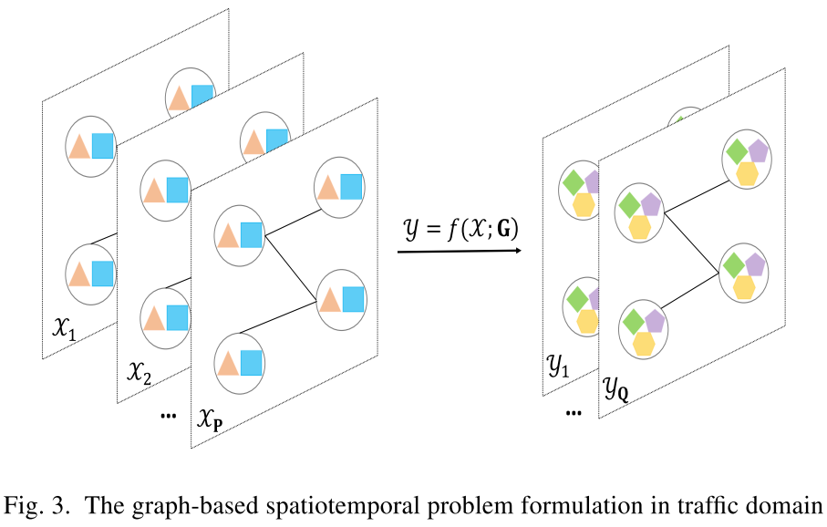

该问题（如图3所示）可以表述为：
$$
\mathcal{Y}=f(\mathcal{X} ; \mathbf{G}) \tag{1}
$$
一些工作预测未来多个交通指标（即$F_O> 1$），而另一些作品预测一个交通指标（即$F_O = 1$），例如交通速度[80]，[76]，rail-hide orders[74]，[73]。有些作品只考虑了单步预测[83]，[66]，[49]，即预测下一时间步的交通状况，即$Q =1$。但是为单步预测而设计的模型不能直接应用于预测多步，因为它们是通过减少在训练阶段的错误而不是后续时间步骤来优化的[67]。许多工作着重于多步预测（即$Q> 1$）[84]，[18]，[85]。根据我们的调查，主要有三种产生多步输出的技术，即FC层，Seq2Seq，膨胀技术。全连接（FC）层是最简单的技术，它是获得所需输出形状的输出层[62]，[61]，[86]，[70]，[87]，[88]。一些作品采用基于序列的序列（Seq2Seq）体系结构和基于RNN的解码器，通过多个步骤[89]，[79]，[71]，[84]，[90]，[77]递归生成输出。[82]，[85]采用膨胀技术来获得所需的输出长度。

此外，有些作品不仅考虑了与交通相关的测量，而且还考虑了外部因素（例如时间属性，天气）[62]，[91]，[87]，[92]。因此，问题的表述变为：
$$
\mathcal{Y}=f(\mathcal{X}, \mathcal{E} ; \mathbf{G})  \tag{2}
$$
其中 $\mathcal{E}$ 代表外部因素.

## Graph Construction from Traffic Datasets

将交通网络建模为图形对于任何打算利用基于图形的深度学习架构的工作都至关重要。即使许多工作都有类似的问题表述，但由于它们收集的交通数据集，它们在图形构造上也有所不同。我们发现，根据相关的交通基础设施，这些数据集可以分为四类：道路网络上的传感器数据[62]，[61]，[63]，出租车的GPS轨迹[60]，[93]，[76]，订单轨道交通系统[73]，[67]，[92]，地铁[68]，[69]或公交系统[93]的交易记录。对于每种类别，我们描述数据集并解释交通图$G$中节点$V$，边$E$，特征矩阵$X_t$的构造。

### Sensors Datasets

交通测量值（例如，行车速度）通常由传感器（例如，环路检测器，探头）每30秒钟收集一次。例如北京[74]，加利福尼亚[63]，洛杉矶[62]，纽约[80]，费城[86]，西雅图[75]，厦门[79]和华盛顿[86]等大城市的道路网络。传感器数据集是现有作品中最流行的数据集，尤其是加利福尼亚州的PEMS数据集。通常，道路网络包含交通对象，例如传感器，路段（如图4所示）。一些现有的作品构建了一个传感器图[62]，[61]，[77]，而另一些则构建了一个路段图[74]，[80]，[86]。

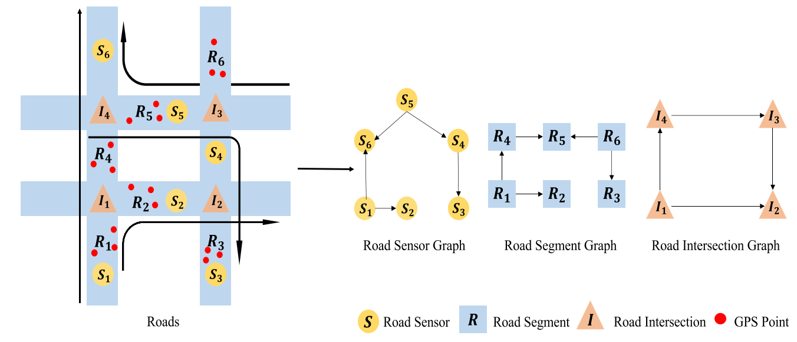

图4.交通数据集的图形构造：1）在传感器图中，传感器代表节点，并且在道路同一侧的相邻传感器之间有一条边。传感器的特征是交通量度可以自行校正。2）在路段图中，路段代表节点，两个相连的路段具有边。在传感器数据集中，路段的特征是其上所有传感器记录的平均交通测量值（例如，交通速度）。在GPS数据集中，每个路段的特征是该路段上所有GPS点记录的平均路况测量值。3）在道路交叉点图中，道路交叉点表示节点，并且通过路段连接的两个道路交叉点具有边。路段的特征是通过路段的交通量的总和。大多数作品将边缘方向视为交通流的方向[62]，[79]，[58]，[77]，[60]，[93]，而有些作品则忽略了方向，并构造了无向图[61]，[82]，[75] [81]，[76]。

### GPS Datasets

GPS轨迹数据集通常由一段时间内的出租车数量生成，例如北京[60]，成都[60]，深圳[70]，科隆[76]和芝加哥[81]。每辆出租车每天都会产生大量带时间，空间和速度信息的GPS点。每个GPS记录都适合城市路线图上最近的道路。通过道路交叉口，所有道路均分为多个路段。一些作品提取了道路线段图[81]，[70]，而另一些作品提取了道路交叉口图[64]，[60]，[76]（如上图4所示）。

### Rail-hailing Datasets

这些数据集记录了一段时间内北京[74]，[73]，成都[73]和上海[74]等城市的汽车/出租车/自行车需求订单。具有OpenStreetMap的目标城市被划分为等大小的基于网格的区域。每个区域都定义为图中的一个节点。每个节点的特征是在给定间隔内其区域内的订单数。[74]，[73]观察到节点之间的各种相关性对于预测是有价值的，并且构建了多个图（如图5所示）。

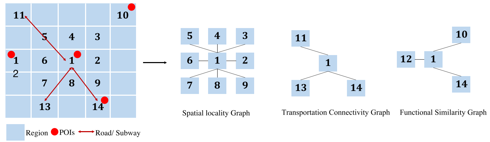

图5. 多重关系：1）空间局部性图：此图基于空间邻近性，并且在3 x 3的网格中构造区域及其8个相邻区域之间的边缘。2）交通运输连通性图：该图假定地理上相距遥远但可以通过高速公路，高速公路或地铁方便到达的区域与目标区域具有很强的相关性。它们之间应该有边缘。3）功能相似度图：此图假定共享相似功能的区域可能具有相似的需求模式。在具有类似周围POI的区域之间构造边缘。

### Transactions Datasets

这些数据集是从地铁或公交交易系统生成的，可以从中构建地铁图[68]，[69]，[93]或公交图[93]。

地铁图：地铁系统中的每个站都被视为一个节点。如果地铁线路的两个站点相邻，则它们之间会有一条边缘，反之亦然。工作站的功能通常是给定时间间隔内的流入和流出记录。

公交车图：每个公交车站都被视为一个节点。如果公交线路中的两个公交车站相邻，则它们之间会有一条边缘，反之亦然。公交车站的特征通常是给定时间间隔内的入口记录以及其他特征。

## Adjacency Matrix

邻接矩阵$\mathbf{A}=\left(\mathbf{a}_{i j}\right)_{\mathbf{N} \times \mathbf{N}} \in \mathbb{R}^{\mathbf{N} \times \mathbf{N}}$是提取交通图拓扑的关键元素，对预测具有重要意义。元素$a_{ij}$（二进制或加权）表示节点之间的异构成对关系。但是，根据交通场景中的不同假设，可以采用非常不同的方式来设计矩阵，例如固定矩阵和动态矩阵。

### Fixed Matrix

许多工作都假设节点之间的相关性是基于一些先验知识而固定的，并且不会随时间变化。因此，设计了一个固定的矩阵，并且在整个实验过程中保持不变。另外，一些工作提取了节点之间的多个关系，从而产生了多个固定矩阵[57]，[43]。通常，预定义的矩阵表示交通网络中的空间依赖性，而在某些工作中，它还捕获其他种类的相关性，例如功能相似性和运输连通性[74]，语义连接[73]，时间相似性[63]。对于条目值$a_ij$，在某些作品[61]，[86]，[70]，[75]中定义为1（连接）或0（断开）。在许多其他著作中，它被定义为节点[64]，[60]，[81]，[78]，[67]，[76]之间的距离的函数。[74]，[62]，[91]，[79]，[82]，[77]。他们使用阈值高斯核定义$a_{ij}$如下：
$$
\mathbf{a}_{i j}=\left\{\begin{array}{l}
\exp \left(-\frac{\mathbf{d}_{i j}^{2}}{\sigma^{2}}\right), i \neq j \text { and } \mathbf{d}_{i j} \geq \epsilon \\
0 \quad, i=j \text { or } \mathbf{d}_{i j}<\epsilon
\end{array}\right. \tag{3}
$$
其中$d_{ij}$是节点$i$与节点$j$之间的距离。超参数$σ^2$和$\epsilon$是控制矩阵A分布和稀疏性的阈值。

### Dynamic Matrix

一些工作认为，由于有缺陷的先验知识或不完整的数据，预定义的矩阵不一定反映节点之间的真正依赖性[64]。提出了一种新颖的自适应矩阵，并通过节点嵌入来学习。[82]，[64]，[80]中的实验证明，自适应矩阵可以精确地捕获数据中隐藏的空间依赖性。

在某些情况下，图结构可能会随着时间的推移而演变，因为某些边缘可能变得不可用，例如道路拥堵或封闭，并在缓解拥塞后又变得可用。不断发展的拓扑结构[58]被纳入模型以捕获这种动态空间变化。

# Deep Learning Techniques Perspective

我们总结了现有交通文献中的许多基于图的深度学习架构，发现它们大多数由图神经网络（GNN）和其他模块组成，例如递归神经网络（RNN），时间卷积网络（TCN），序列到序列（Seq2Seq）模型，生成对抗网络（GAN）（如表II所示）。正是GNN与其他深度学习技术的合作才能在许多交通场景中实现最先进的性能。本部分旨在介绍其在交通任务中的原理，优点，缺陷及其变体，以帮助参与者了解如何在交通领域中利用深度学习技术。

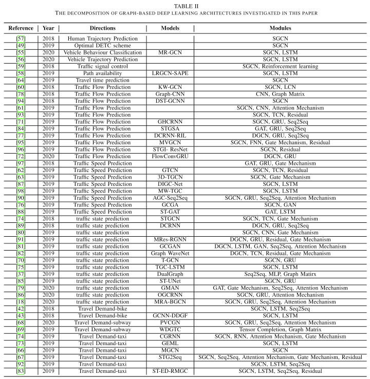

## [GNNs](#content)

在过去的两年中，受深度学习方法（例如CNN，RNN）的巨大成功的激励，人们越来越有兴趣将神经网络泛化为任意结构化的图，并且这种网络被归类为图神经网络。许多工作着重于扩展CNN用于图数据的卷积，并且图上的新型卷积已得到迅速发展。与交通任务相关的两个主流图卷积是无向图的谱图卷积（SGC）和有向图的扩散图卷积（DGC）。也有其他新颖的卷积[60]，但相关的流量工作相对较少。SGC和DGC都旨在通过特征聚合和非线性变换为图中的每个节点生成新的特征表示（如图6所示）。请注意，我们将SGC网络称为SGCN，将DGC网络称为DGCN。

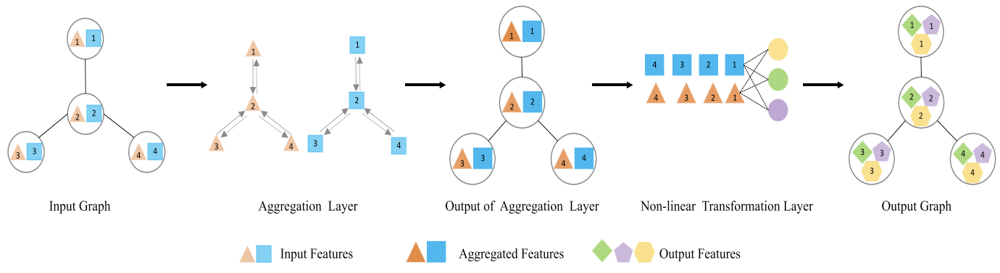

图6：图神经网络的一般结构由两层组成：1）聚合层：在每个特征维上，相邻节点的特征被聚合到中心节点。在数学上，聚合层的输出是邻接矩阵和特征矩阵的乘积。2）非线性变换层：随后，每个节点的所有聚合特征都被馈送到非线性变换层中以创建更高的特征表示。所有节点共享相同的转换内核。

### [Spectral Graph Convolution](#content)

在频谱理论中，图由其对应的归一化拉普拉斯矩阵$\mathbf{L}=\mathbf{I}_{\mathrm{N}}-\mathbf{D}^{-\frac{1}{2}} \mathbf{A} \mathbf{D}^{-\frac{1}{2}} \in \mathbb{R}^{\mathbf{N} \times \mathbf{N}}$表示。实对称矩阵$L$可以通过特征分解对角化，如$\mathbf{L}=\mathbf{U} \mathbf{\Lambda} \mathbf{U}^{T}$，其中$\mathbf{U} \in \mathbb{R}^{\mathbf{N} \times \mathbf{N}}$是特征向量矩阵，而$\boldsymbol{\Lambda} \in \mathbb{R}^{\mathbf{N} \times \mathbf{N}}$是对角特征值矩阵。由于$U$也是正交矩阵，[99]将其用作图傅立叶基础，将图信号$x \in \mathbb{R}^{\mathbf{N}}$的图傅里叶变换定义为$\hat{x}=\mathbf{U}^{T} x$，其逆取为$x=\mathbf{U} \hat{x}$。

[100]尝试将CNN卷积的类似物建立到光谱域中，并将光谱卷积定义为$y=\Theta *_{\mathcal{G}} x=\mathbf{U} \Theta \mathbf{U}^{T} x$，将$x$转换为光谱域，通过对角核调整其振幅$\Theta=\operatorname{diag}\left(\theta_{0}, \ldots, \theta_{\mathbf{N}-1}\right) \in \mathbb{R}^{\mathbf{N} \times \mathbf{N}}$，并进行傅立叶逆变换以获得空间域中的最终结果$y$。尽管从理论上保证了这种卷积，但在计算上是昂贵的，因为与$U$的乘积为$O(N^2)$，而$L$的本征分解对于大规模图形是无法接受的。此外，它会使用$N$个参数以内核$\theta$考虑所有节点，因此无法提取空间定位。

为避免这种局限性，[101]通过限制内核$\theta$为特征值矩阵$\boldsymbol{\Lambda}$的多项式来局限卷积并减少其参数，因为$\Theta=\sum_{k=0}^{K-1} \theta_{k} \Lambda^{k}$，而$K$从a确定卷积的最大半径中央节点。因此，可以将卷积改写为：$\Theta *_{\mathcal{G}} x=\sum_{k=0}^{K-1} \theta_{k} \mathbf{U} \mathbf{\Lambda}^{k} \mathbf{U}^{T} x=\sum_{k=0}^{\mathbf{K}-1} \theta_{k} \mathbf{L}^{k} x$。更进一步，[101]采用Chebyshev多项式$T_k(x)$逼近$L^k$，得到$\Theta *_{\mathcal{G}} x \approx \sum_{k=0}^{K-1} \theta_{k} T_{k}(\tilde{\mathbf{L}}) x$，重定比例为$\tilde{\mathbf{L}}=\frac{2}{\lambda_{\max }} \mathbf{L}-\mathbf{I}_{\mathbf{N}}$，$λ_{max}$是$L$的最大特征值，$T_{k}(x){=} 2 x T_{k-1}(x)-T_{k-2}(x), T_{0}(x)=1$,$T1(x) = x$ [102]。通过递归计算$Tk(x)$，可以将此K-localized卷积的复杂度降低为$\mathcal{O}(\mathbf{K}|\mathbf{E}|)$，其中$|\mathbf{E}|$是边的数量。

基于[101]，[103]，通过限制$K = 2$简化了频谱图卷积，并且在$T_0(\tilde{\mathbf{L}})= 1$的情况下，$T_1(\tilde{\mathbf{L}})=\tilde{\mathbf{L}}$，他们得到$\Theta *_{\mathcal{G}} x \approx \theta_{0} T_{0}(\tilde{\mathbf{L}}) x+\theta_{1} T_{1}(\tilde{\mathbf{L}}) x=\theta_{0} x+\theta_{1} \tilde{\mathbf{L}} x$。注意到$\tilde{\mathbf{L}}=\frac{2}{\lambda_{\max }} \mathbf{L}-\mathbf{D}$，他们将$λ_{max}= 2$设置为$\Theta *_{\mathcal{G}} x \approx \theta_{0} x+\theta_{1}(\mathbf{L}-\mathbf{D}) x$。对于该$\mathbf{I}_{\mathrm{N}}-\mathbf{D}^{-\frac{1}{2}} \mathbf{A} \mathbf{D}^{-\frac{1}{2}}$ 和 $\mathbf{L}=\mathbf{L}-\mathbf{I}_{\mathrm{N}}=-\mathbf{D}^{-\frac{1}{2}} \mathbf{A} \mathbf{D}^{-\frac{1}{2}}$，它们得到$\Theta *_{\mathcal{G}} x \approx \theta_{0} x-\theta_{1}\left(\mathbf{D}^{-\frac{1}{2}} \mathbf{A} \mathbf{D}^{-\frac{1}{2}}\right) x$。此外，他们通过设置$θ=θ_0=-θ_1$来解决过度拟合，从而减少了参数数量，并得到$\Theta *_{\mathcal{G}} x \approx \theta\left(\mathbf{I}_{\mathrm{N}}+\mathbf{D}^{-\frac{1}{2}} \mathbf{A} \mathbf{D}^{-\frac{1}{2}}\right) x$。他们进一步定义$\mathbf{A}=\mathbf{A}+\mathbf{I}_{\mathbf{N}}$，并采用重归一化技巧，得到$y=\Theta *_{G} x \approx \theta \tilde{\mathbf{D}}^{-\frac{1}{2}} \tilde{\mathbf{A}} \tilde{\mathbf{D}}^{-\frac{1}{2}} x$，其中$\tilde{\mathbf{D}}$是$\tilde{\mathbf{A}}$的度矩阵。最后，[103]提出了频谱图卷积层为：
$$
\begin{aligned}
Y_{j} &=\rho\left(\Theta_{j} *_{\mathcal{G}} X\right) \\
&=\rho\left(\sum_{i=1}^{\mathbf{F}_{\mathrm{I}}} \theta_{i, j} \tilde{\mathbf{D}}^{-\frac{1}{2}} \tilde{\mathbf{A}} \tilde{\mathbf{D}}^{-\frac{1}{2}} X_{i}\right), 1 \leq j \leq \mathbf{F}_{\mathrm{O}} \\
Y &=\boldsymbol{\rho}\left(\tilde{\mathbf{D}}^{-\frac{1}{2}} \tilde{\mathbf{A}} \tilde{\mathbf{D}}^{-\frac{1}{2}} X W\right)
\end{aligned} \tag{4}
$$
这里，$X \in \mathbb{R}^{\mathbf{N} \times \mathbf{F}_{\mathbf{I}}}$是具有$F_I$特征的图输入，$X_i \in \mathbb{R}^N$是其第$i$个特征。$Y \in \mathbb{R}_{N×F_O}$是图输出，$Y_j \in \mathbb{R}^N$是其第$j$个特征。$W \in \mathbb{R}^{F_I×F_O}$是可训练的参数。$\rho=(\cdot)$是激活函数。这样的层可以聚合1跳邻居的信息。可以通过堆叠多个图卷积层来扩展接收邻域[18]。

### [Diffusion Graph Convolution](#content)

频谱图卷积需要对称的拉普拉斯矩阵来实现特征分解。对于具有不对称拉普拉斯矩阵的有向图，它变得无效。扩散卷积源自图扩散而对图没有任何约束。图扩散[104]，[105]可以表示为转移矩阵的幂级数，给出在每一步从节点$i$跳到节点$j$的概率。经过许多步骤，这种马尔可夫过程收敛到平稳分布$\mathcal{P}=\sum_{k=0}^{\infty} \alpha(1-\alpha)^{k}\left(\mathbf{D}_{\mathbf{O}}^{-1} \mathbf{A}\right)^{k}$，其中$D_O^{-1}A$是转移矩阵，$α \in [0,1]$是重新启动概率，$k$是扩散步骤。实际上，采用了扩散过程的有限$K$步截断，并且为每个步分配了可训练的权重$\theta$。基于K步扩散过程，[89]将扩散图卷积定义为：
$$
y=\Theta *_{\mathcal{G}} x=\sum_{k=0}^{K-1}\left(\theta_{k, 1}\left(\mathbf{D}_{\mathbf{O}}^{-1} \mathbf{A}\right)^{k}+\theta_{k, 2}\left(\mathbf{D}_{\mathbf{I}}^{-1} \mathbf{A}^{T}\right)^{k}\right) x \tag{5}
$$
在此，$D_O^{-1}A$和$D_I^{-1}A^T$分别表示转移矩阵及其逆矩阵。这种双向扩散使操作能够捕获有向图上的空间相关性[89]。与光谱图卷积层相似，扩散图卷积层的构建如下：
$$
\begin{aligned}
Y_{j} &=\rho\left(\Theta_{j} *_{\mathcal{G}} X\right) \\
&=\rho\left(\sum_{k=0}^{\mathrm{K}-1} \sum_{i=1}^{\mathrm{F}_{\mathrm{I}}}\left(\theta_{k, 1}\left(\mathrm{D}_{\mathrm{O}}^{-1} \mathbf{A}\right)^{k}+\theta_{k, 2}\left(\mathbf{D}_{\mathbf{I}}^{-1} \mathbf{A}^{T}\right)^{k}\right) X_{i}\right) \\
1 & \leq j \leq \mathbf{F}_{\mathbf{O}} \\
Y &=\boldsymbol{\rho}\left(\sum_{k=0}^{\mathbf{K}-1}\left(\mathbf{D}_{\mathbf{O}}^{-1} \mathbf{A}\right)^{k} X W_{k 1}+\left(\mathbf{D}_{\mathbf{I}}^{-1} \mathbf{A}^{T}\right)^{k} X W_{k 2}\right)
\end{aligned} \tag{6}
$$
其中参数$W_{k1}，W_{k2} \in \mathbb{R}^{F_I×F_O}$是可训练的。

### [GNNs in Traffic Domain](#content)

许多交通网络自然是图结构（请参见第三部分）。但是，以前的研究只能大致捕获空间局部性，这是由于将它们建模为网格或网段网络的折衷[106]，[107]，而忽略了交通网络的连通性和全局性。在我们研究的文献中，他们都将交通网络建模为图表，以充分利用空间信息。

许多工作直接在交通图上使用卷积运算来捕获交通数据的复杂空间依赖性。它们中的大多数采用频谱图卷积（SGC），而有些采用扩散图卷积（DGC）[91]，[89]，[81]，[82]，[77]，[72]。还有其他一些图神经网络，例如图注意力网络（GAT）[97]，[88]，[79]，[84]，图上的张量分解和聚合[69]，但它们的相关工作很少，它们可能是未来的研究方向。

SGC和DGC之间的关键区别在于它们的矩阵，它们代表了交通网络空间相关性的不同假设。SGC中的邻接矩阵推断出图中的中心节点与其直接相邻节点的关联性强于其他远距离节点，这反映了许多交通场景中的现实[74]，[62]。DGC中的状态转换矩阵表明空间依赖性是随机的和动态的，而不是固定的和规则的。交通流与交通图上的扩散过程有关，以对其变化的空间相关性建模。另外，DGC中的双向扩散为模型提供了更大的灵活性，可以捕获来自上游和下游流量的影响[89]。总之，DGC比SGC更复杂。DGC可用于任何交通网络图中，而SGC仅可用于处理对称交通图。

当涉及与交通有关的空间时间预测问题时，输入的是3-D张量$X \in \mathbb{R}^{P×N×F_I}$，而不是2-D张量$X \in \mathbb{R}^{N×F_I}$。因此，卷积运算需要进一步推广到3-D张量。在许多工作中，具有相同内核的同等卷积运算（例如SGC，DGC）被并行地施加于$\mathcal{X}$的每个时间步[74]，[62]，[93]，[94]。

另外，为了提高交通任务中图卷积的性能，许多作品根据其预测目标开发了SGC的一些变体以及其他技术。

例如，[61]用注意力机制重新定义了SGC，以自适应地捕获交通网络中的动态相关性: $\Theta *_{\mathcal{G}} x \approx \sum_{k=0}^{\mathrm{K}-1} \theta_{k}\left(T_{k}(\tilde{\mathbf{L}}) \odot \mathbf{S}\right) x$，其中$S=W_{1} \odot \rho\left(\left(X W_{2}\right) W_{3}\left(W_{4} X\right)^{T}+b\right) \in \mathbb{R}^{N \times N}$是空间关注度。

[63]通过扫描图上的$K$阶邻居和时间轴上的$K_t$邻居而无需填充，从而在空间和时间维度上对SGC进行了广义化，从而在每一步将序列的长度缩短了$K_t − 1$：
$$
\mathcal{Y}_{t, j}=\boldsymbol{\rho}\left(\sum_{t^{\prime}=0}^{\mathbf{K}_{t}-1} \sum_{k=0}^{\mathbf{K}-1} \sum_{i=1}^{\mathbf{F}_{\mathrm{I}}} \theta_{j, t^{\prime}, k, i} \tilde{\mathbf{L}}^{k} \mathcal{X}_{t-t^{\prime}, i}\right) \tag{7}
$$
其中$\mathcal{X}_{t-t^{\prime}, i} \in \mathbb{R}^{\mathbf{N}}$是在时间$t-t^{\prime}$处输入$X$的第$i$个特征，$\mathcal{Y}_{t, j} \in \mathbb{R}^{\mathbf{N}}$是在时间$t$处输出$Y$的第$j$个特征。

[75]将SGC更改为$\Theta *_{\mathcal{G}} x=\left(W \odot \tilde{\mathbf{A}}^{\mathbf{K}} \odot \mathcal{F} \mathcal{F} \mathcal{R}\right) x$，其中$\tilde{\mathbf{A}}^K$是K跳邻域矩阵，而FFR是代表道路物理特性的矩阵。[98]，[90]紧接着这项工作，并重新定义了$\Theta *_{\mathcal{G}} x=(W \odot\left.B i\left(\mathbf{A}^{\mathbf{K}}+\mathbf{I}_{\mathbf{N}}\right)\right) x$，其中$B i(.)$是将矩阵中每个非零元素剪裁为1的函数。[95]

[95]将SGC中的邻接矩阵$A$修改为$S = A \odot w$将地理空间位置信息整合到模型中，其中$ω$是通过阈值高斯核加权函数计算的矩阵。将该层构建为$Y=\rho\left(\tilde{\mathbf{Q}}^{-\frac{1}{2}} \tilde{\mathbf{S}} \tilde{\mathbf{Q}}^{-\frac{1}{2}} X W\right)$，其中$\tilde{\mathbf{Q}}$是$\tilde{\mathbf{S}}=S+I_N$的度矩阵。

[49]设计了一种新颖的基于边缘的道路网络SGC，以提取边缘特征的时空相关性。特征矩阵X和邻接矩阵A都在边上而不是节点上定义。

## [RNNs](#content)

递归神经网络（RNN）是一种神经网络体系结构，主要用于检测数据序列中的模式[108]。在许多交通任务中收集的交通数据是时间序列数据，因此在这些交通文献中通常使用RNN来捕获交通数据中的时间依赖性。在本小节中，我们介绍了RNN的三种经典模型（即RNN，LSTM，GRU）以及它们之间的相关性，这为实验人员为特定交通问题选择合适的模型提供了理论依据。

### [RNN](#content)

类似于经典前馈神经网络（FNN），简单的递归神经网络（RNN）[109]包含三层，即输入层，隐藏层，输出层[110]。RNN与FNN的区别在于隐藏层。它在FNN中将信息传递到输出层，而在RNN中，它也将信息传递回自身形成一个循环[108]。因此，RNN中的隐藏层称为循环隐藏层。这种循环技巧可以保留历史信息，从而使RNN可以处理时间序列数据。

假设RNN的输入，隐藏和输出层分别有$F_I,F_H,F_O$单元。输入层采用时间序列数据$\mathbf{X}=\left[\mathbf{X}_{1}, \cdots, \mathbf{X}_{\mathbf{P}}\right] \in \mathbb{R}^{\mathbf{P} \times \mathbf{F}_{\mathbf{I}}}$。对于时间$t$的每个元素，隐藏层将其转换为$H_t \in \mathbb{R}^{F_H}$，而输出层将$H_t$映射为$Y_t \in \mathbb{R}^{F_O}$。注意，隐藏层不仅将$X_t$作为输入，而且还将$H_{t-1}$作为输入。这种循环机制使RNN可以记住过去的信息（如图7所示）。

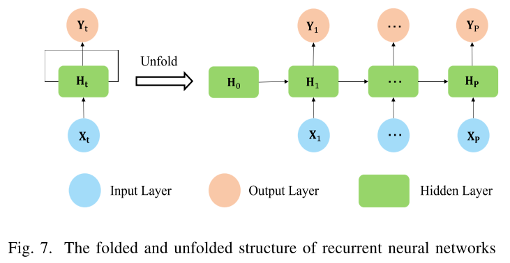

隐藏层和输出层的数学符号如下。
$$
\begin{array}{l}
\mathbf{H}_{t}=\tanh \left(\left[\mathbf{H}_{t-1}, \mathbf{X}_{t}\right] \cdot W_{h}+b_{h}\right) \\
\mathbf{Y}_{t}=\rho\left(\mathbf{H}_{t} \cdot W_{y}+b_{y}\right)
\end{array} \tag{8}
$$
其中$W_{h} \in \mathbb{R}^{\left(\mathbf{F}_{\mathbf{I}}+\mathbf{F}_{\mathbf{H}}\right) \times \mathbf{F}_{\mathbf{H}}}, W_{y} \in \mathbb{R}^{\mathbf{F}_{\mathbf{H}} \times \mathbf{F}_{\mathbf{O}}}, b_{h} \in \mathbb{R}^{\mathbf{F}_{\mathbf{H}}},b_{y} \in \mathbb{R}^{\mathbf{F}_{\mathrm{O}}}$是可训练的参数。$t=1, \cdots, \mathbf{P}$和P是输入序列的长度。使用小的非零元素初始化$H_0$，这可以改善网络的整体性能和稳定性[111]。

简而言之，RNN将顺序数据作为输入，并生成RNN另一个长度相同的序列：$\left[\mathbf{X}_{1}, \cdots, \mathbf{X}_{\mathbf{P}}\right] \stackrel{R N N}{\longrightarrow}\left[\mathbf{Y}_{1}, \cdots, \mathbf{Y}_{\mathbf{P}}\right]$。请注意，我们可以通过堆叠多个递归隐藏层来加深RNN。

### [LSTM](#content)

尽管隐藏状态使RNN可以记住过去时间步长上的输入信息，但是它也引入了（可能很长）序列上的矩阵乘法。矩阵乘法中的小值会导致梯度在每个时间步减小，从而导致最终消失现象，而相反的大值会导致爆炸问题[112]。梯度的上升或消失实际上阻碍了RNN学习数据中长期顺序依存关系的能力[110]。

为了克服这一障碍，提出了长短期记忆（LSTM）神经网络[113]以捕获序列学习中的长期依赖性。与RNN中的隐藏层相比，LSTM隐藏层具有额外的四个部分，分别是存储单元，输入门，忘记门和输出门。范围为[0,1]的这三个门可以控制信息流入存储单元，并保留先前时间步长中提取的特征。这些简单的更改使存储单元能够存储和读取尽可能多的长期信息。LSTM隐藏层的数学符号如下。
$$
\begin{aligned}
i_{t} &=\boldsymbol{\sigma}\left(\left[\mathbf{H}_{t-1}, \mathbf{X}_{t}\right] \cdot W_{i}+b_{i}\right) \\
o_{t} &=\boldsymbol{\sigma}\left(\left[\mathbf{H}_{t-1}, \mathbf{X}_{t}\right] \cdot W_{o}+b_{o}\right) \\
f_{t} &=\boldsymbol{\sigma}\left(\left[\mathbf{H}_{t-1}, \mathbf{X}_{t}\right] \cdot W_{f}+b_{f}\right) \\
\mathbf{C}_{t} &=f_{t} \odot \mathbf{C}_{t-1}+i_{t} \odot \tanh \left(\left[\mathbf{H}_{t-1}, \mathbf{X}_{t}\right] \cdot W_{c}+b_{c}\right) \\
\mathbf{H}_{t} &=o_{t} \odot \tanh \left(\mathbf{C}_{t}\right)
\end{aligned} \tag{9}
$$
其中，$i_t,o_t，f_t$分别输入门，输出门，忘记门。$C_t$是存储单元在时间$t$的值。

### [GRU](#content)

虽然LSTM是避免梯度消失或爆炸的可行选择，但其复杂的结构导致更多的内存需求和更长的训练时间。[114]提出了一种简单但功能强大的LSTM变体，即门控循环单元（GRU）。LSTM单元具有三个门，而GRU单元仅具有两个门，从而导致参数更少，从而缩短了训练时间。但是，GRU在经验上与LSTM一样有效[114]，并广泛用于各种任务。GRU隐藏层的数学符号如下。
$$
\begin{aligned}
r_{t} &=\boldsymbol{\sigma}\left(\left[\mathbf{H}_{t-1}, \mathbf{X}_{t}\right] \cdot W_{r}+b_{r}\right) \\
u_{t} &=\boldsymbol{\sigma}\left(\left[\mathbf{H}_{t-1}, \mathbf{X}_{t}\right] \cdot W_{u}+b_{u}\right) \\
\tilde{\mathbf{H}}_{t} &=\boldsymbol{t a n h}\left(r_{t} \odot\left[\mathbf{H}_{t-1}, \mathbf{X}_{t}\right] \cdot W_{h}+b_{h}\right) \\
\mathbf{H}_{t} &=u_{t} \odot \mathbf{H}_{t-1}+\left(1-u_{t}\right) \odot \tilde{\mathbf{H}}_{t}
\end{aligned} \tag{10}
$$
其中$r_t$是复位门，$u_t$是更新门。

### [RNNs in Traffic Domain](#content)

RNN已显示出令人印象深刻的稳定性和处理时间序列数据的能力。由于交通数据具有明显的时间依赖性，因此通常利用RNN捕获交通数据中的时间相关性。在我们调查的工作中，只有[74]使用RNN捕获流量中的时间依赖性，而超过一半的研究采用了GRU，有些则采用了LSTM。这可以解释为RNN在严重的梯度消失或梯度爆炸中得以幸存，而LSTM和GRU成功地解决了这一问题，而GRU可以缩短训练时间。

此外，还有许多技巧可以增强RNN的能力，以建模交通领域中的复杂时间动态，例如注意机制，门控机制，残差机制。

例如，[74]将上下文信息（即包含相关区域信息的SGCN的输出）合并到注意力操作中，以建模不同时间戳下的观测值之间的相关性：$z=F_{\text {pool}}\left(\mathbf{X}_{t}, S G C N\left(\mathbf{X}_{t}\right)\right)$和$S=\sigma\left(W_{1} \operatorname{Re} L U\left(W_{2} z\right)\right), \mathbf{H}_{t}=RNN\left(\left[\mathbf{H}_{t-1}, \mathbf{X}_{t}\right] \odot S\right)$，其中$Fpool(·)$是全局平均池化层，$RNN(·)$表示RNN隐藏层。

[91]通过将外部属性嵌入到输入中来考虑外部因素。此外，他们还通过残差链接将先前的隐藏状态添加到了下一个隐藏状态，他们认为这可以使GRU对交通历史观测值的突然变化更加敏感和健壮。新的隐藏状态公式如下：$\mathbf{H}_{t}=G R U\left(\left[\mathbf{H}_{t-1}, \mathbf{X}_{t}\right], \mathbf{E}_{t}\right)+\mathbf{H}_{t-1} W$，其中$E_t$是时间t的外部特征，$W$是线性可训练参数，$H_{t-1}W$是残差链接。

[85]通过将扩张的跳层连接插入GRU，通过将隐藏状态从$\mathbf{H}_{t}=G R U\left(\left[\mathbf{H}_{t-1}, \mathbf{X}_{t}\right]\right)$更改为$\mathbf{H}_{t}=G R U\left(\mathbf{H}_{t-s}, \mathbf{X}_{t}\right)$，其中s表示每个的扩张长度或扩张率，$GRU(·)$表示GRU隐藏层。这种分层的扩展设计为不同层的循环单元带来了多个时间尺度，从而实现了多时间尺度建模。

尽管有上述技巧，但有些工作用光谱图卷积（SGC）或扩散图卷积（DGC）代替了RNN隐藏层中的矩阵乘法，以共同捕获空间时域相关性。以GRU为例：
$$
\begin{aligned}
r_{t} &=\boldsymbol{\sigma}\left(\left[\mathbf{H}_{t-1}, \mathbf{X}_{t}\right] *_{\mathcal{G}} W_{r}+b_{r}\right) \\
u_{t} &=\boldsymbol{\sigma}\left(\left[\mathbf{H}_{t-1}, \mathbf{X}_{t}\right] *_{\mathcal{G}} W_{u}+b_{u}\right) \\
\tilde{\mathbf{H}}_{t} &=\tanh \left(r_{t} \odot\left[\mathbf{H}_{t-1}, \mathbf{X}_{t}\right] *_{\mathcal{G}} W_{h}+b_{h}\right) \\
\mathbf{H}_{t} &=u_{t} \odot \mathbf{H}_{t-1}+\left(1-u_{t}\right) \odot \tilde{\mathbf{H}}_{t}
\end{aligned} \tag{11}
$$
G可以代表SGC，DGC或其他变体。在我们调查的文献中，大多数替换发生在GRU中，而只有一种发生在LSTM中[58]。在GRU相关交通工作中，[91]，[89]，[86]，[77]，[72]将矩阵乘法替换为DGC，[18]，[85]，[68]替换为SGC，[84]，[97]替换为GAT。

请注意，除了RNN外，其他技术（例如，下一部分中的TCN）也是提取交通任务中时间动态的常用选择。

## [TCN](#content)

尽管基于RNN的模型在时间序列分析中变得很普遍，但用于流量预测的RNN仍然要耗费大量时间，复杂的门机制以及对动态变化的缓慢响应[74]。相反，一维神经网络具有训练快速，结构简单，对先前步骤没有依赖性的优势[115]。然而，实际上，一维CNN比RNN少见，这是因为它缺乏长序列的记忆[116]。2016年，[117]提出了一种新颖的将因果卷积和扩张卷积相结合的卷积运算，在文本转语音任务中胜过RNN。因果卷积的预测取决于先前的要素，而不取决于未来的要素。扩张卷积通过将其过滤为零来扩展原始过滤器的感受野[118]。[119]简化了[117]中因果关系的卷积，用于序列建模问题，并将其重命名为时间卷积网络（TCN）。近年来，越来越多的作品采用TCN来处理交通时序数据[74]，[62]，[82]，[93]。

### [Sequence Modeling and 1-D TCN](#content)

给定长度为P的输入序列表示为$\mathbf{x}=\left[\mathbf{x}_{1}, \cdots, \mathbf{x}_{\mathbf{P}}\right] \in \mathbb{R}^{\mathbf{P}}$，序列建模旨在生成具有相同长度的输出序列，表示为$\mathbf{y}=\left[\mathbf{y}_{1}, \cdots, \mathbf{y}_{\mathbf{P}}\right] \in \mathbb{R}^{\mathbf{P}}$。关键的假设是，当前时间$y_t$的输出仅与历史数据$[x1，\cdots ，xt]$相关，而与未来的任何输入$[x_{t+1}，\cdots ，xP]$不相关，即$yt = f(x1，\cdots ，xt)$，$f$是映射函数。

显然，RNN，LSTM和GRU可以作为序列建模任务的解决方案。但是，TCN可以比RNN更有效地解决序列建模问题，因为它可以以非递归方式正确捕获长序列。TCN中膨胀的因果卷积公式如下：
$$
\mathbf{y}_{t}=\Theta *_{\mathcal{T}^{\mathrm{d}}} \mathbf{x}_{t}=\sum_{k=0}^{\mathbf{K}-1} w_{k} \mathbf{x}_{t-\mathrm{d} k} \tag{12}
$$
其中$* \tau^ \mathrm{d}$是膨胀因果算子，其中膨胀率$d$控制跳跃距离，$\Theta=\left[w_{0}, \cdots, w_{\mathbf{K}-\mathbf{1}}\right] \in \mathbb{R}^{\mathbf{K}}$是内核。零填充策略用于使输出长度与输入长度相同（如图8所示）。如果没有填充，输出长度将缩短$(K-1)d $[74]。

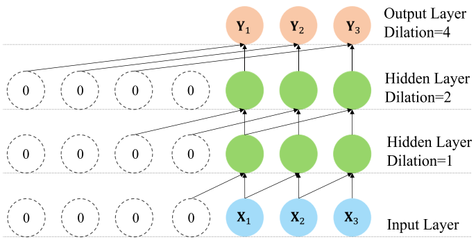

图8. TCN中的多个膨胀因果卷积层：[x1，x2，x3]是输入序列，[y1，y2，y3]是具有相同长度的输出序列。内核的大小为2，层的膨胀率为[1、2、4]。采取零填充策略。

为了增大感受野，TCN堆叠了多个膨胀的因果卷积层，其中$d = 2^l$作为第l层的膨胀率（如图8所示）。因此，网络中的接收域呈指数增长，而无需许多卷积层或较大的过滤器，从而可以用较少层处理较长序列并节省计算资源[82]。

### [TCN in Traffic Domain](#content)

与序列建模有关的交通工作很多，尤其是交通空间时空预测任务。与RNNs相比，非递归计算方式使TCN可以缓解梯度爆炸问题，并通过并行计算促进训练。因此，一些工作采用TCN来捕获交通数据中的时间依赖性。

大多数基于图的交通数据都是3-D张量，表示为$X \in \mathbb{R}^{P×N×F_I}$，这需要将1-DTCN泛化为3-D变量。可以采用经扩大的因果卷积在时刻$t$生成节点$i$的第$j$个输出特征，如下所示[62]：
$$
\begin{aligned}
\mathcal{Y}_{t, j}^{i} &=\rho\left(\Theta_{j} *_{\mathcal{T}^{\mathrm{d}}} \mathcal{X}_{t}^{i}\right) \\
&=\boldsymbol{\rho}\left(\sum_{m=1}^{\mathrm{F}_{\mathrm{I}}} \sum_{k=0}^{\mathrm{K}-1} w_{j, m, k} \mathcal{X}_{t-\mathrm{d} k, m}^{i}\right), 1 \leq j \leq \mathrm{F}_{\mathrm{O}}
\end{aligned} \tag{13}
$$
其中$\mathcal{Y}_{t, j}^{i} \in \mathbb{R}$是节点$i$在时间$t$的第$j$个输出特征。$\mathcal{X}_{t-\mathbf{d} k, m}^{i} \in \mathbb{R}$是节点$i$在时间$t-dk$的第$m$个输入特征。核$\Theta_{j} \in \mathbb{R}^{\mathbf{K} \times \mathbf{F}_{\mathbf{I}}}$是可训练的。$F_O$是输出特征的数量。

将相同的卷积内核应用于流量网络上的所有节点，并且每个节点都会产生$F_O$新特征。$l$层的数学公式如下[62]，[93]
$$
\mathcal{Y}=\Theta * \tau \mathrm{d} \mathcal{X} \tag{14}
$$
其中$\mathcal{X} \in \mathbb{R}^{\mathbf{P} \times \mathbf{N} \times \mathbf{F}_{\mathbf{I}}}$表示过去$P$个时间段内整个交通网络的历史观测值，$\theta \in \mathbb{R}^ {\mathbf{K} \times \mathbf{F}_{\mathbf{I}} \times \mathbf{F}_{\mathbf{O}}}$表示相关的卷积核，$Y \in \mathbb{R}^{P×N×F_O}$是TCN层的输出。

有一些技巧可以增强TCN在特定流量任务中的性能。例如，[93]堆叠了多个TCN层，以按底层提取短期相邻依存关系，并按较高层提取长期时间依存关系：
$$
\mathcal{Y}^{(l+1)}=\sigma\left(\Theta^{l} *_{\mathcal{T} \mathrm{d}^{l}} \mathcal{Y}^{(l)}\right) \tag{15}
$$
其中，$Y^{(l)}$是第l层的输入，$Y^{(l + 1)}$是其第l层的输出，$Y^{(0)}=X$。$d^l = 2^l$是第$l$层的膨胀率。

为了降低模型训练的复杂性，[62]构造了一个包含两个具有相同膨胀率的TCN层的残差块，并将块输入添加到最后一个TCN层以获得块输出：
$$
\mathcal{Y}^{(l+1)}=\mathcal{Y}^{(l)}+\boldsymbol{\operatorname { R e } \boldsymbol { L }} \boldsymbol{U}\left(\Theta_{1}^{l} *_{\mathcal{T}^{\mathrm{d}}}\left(\boldsymbol{\operatorname { R e }} \boldsymbol{L} \boldsymbol{U}\left(\Theta_{0}^{l} *_{\mathcal{T}^{\mathrm{d}}} \mathcal{Y}^{(l)}\right)\right)\right) \tag{16}
$$
其中，$θ_1^l，θ_2^l$分别是第一层和第二层的卷积核。$Y^{(l)}$是残差块的输入，而$Y^{(l + 1 )}$是残差块的输出。

[82]与TCN集成门控机制[116]以学习交通数据中的复杂时间依存关系：
$$
\mathcal{Y}=\boldsymbol{\rho}\left(\Theta_{1} *_{\mathcal{T}^{\mathrm{d}}} \mathcal{X}+b_{1}\right) \odot \boldsymbol{\sigma}\left(\Theta_{2} *_{\mathcal{T}^{\mathrm{d}}} \mathcal{X}+b_{2}\right) \tag{17}
$$
其中$σ(·)\in [0，1]$确定传递到下一层的信息的比率。

类似地，[74]使用门控TCN并设置了扩张率d = 1而无零填充，以将输出长度缩短为$\mathcal{Y}=\left(\Theta_{1} *_{\mathcal{T}^{1}} \mathcal{X}\right) \odot \sigma\left(\Theta_{2} *_{\mathcal{T}^{1}} \mathcal{X}\right)$。他们认为这可以发现时间序列交通数据中的差异。

## [Seq2Seq](#content)

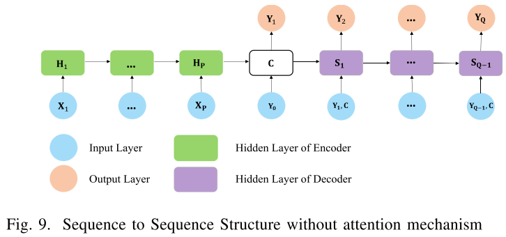

### [Seq2Seq](#content)

2014年提出的Sequence to Sequence（Seq2Seq）模型[120]已广泛用于序列预测，例如机器翻译[121]。Seq2Seq体系结构由两个部分组成，即负责将输入序列X转换为固定潜在矢量C的编码器和负责将C转换为输出序列Y的解码器。请注意，X和Y可以具有不同的长度（如如图9所示）。
$$
\mathbf{X}=\left[\mathbf{X}_{1}, \cdots, \mathbf{X}_{\mathbf{P}}\right] \stackrel{S e q 2 S e q}{\longrightarrow} \mathbf{Y}=\left[\mathbf{Y}_{1}, \cdots, \mathbf{Y}_{\mathbf{Q}}\right] \tag{18}
$$
其中$P$是输入长度，$Q$是输出长度。$Y_j$的具体计算如下：
$$
\begin{aligned}
\mathbf{H}_{i} &=\operatorname{Encoder}\left(\mathbf{X}_{i}, \mathbf{H}_{i-1}\right) \\
\mathbf{C} &=\mathbf{H}_{\mathbf{P}}, \mathbf{S}_{0}=\mathbf{H}_{\mathbf{P}} \\
\mathbf{S}_{j} &=\text {Decoder}\left(\mathbf{C}, \mathbf{Y}_{j-1}, \mathbf{S}_{j-1}\right) \\
\mathbf{Y}_{j} &=\mathbf{S}_{j} W
\end{aligned} \tag{19}
$$
这里，$H_i$是与输入$X_i$相关的隐藏状态。$H_0$使用小的非零元素初始化。$S_j$是与输出$Y_j$相关的隐藏状态。$Y_0$是开始符号的表示。注意，编码器和解码器可以是任何模型，只要它可以接受序列（向量或矩阵）并产生序列即可，例如RNN，LSTM，GRU或其他新颖的模型。

Seq2Seq的一个主要限制是，每个$Y_j$的潜在向量$C$是固定的，而$Y_j$与$X_j$的相关性可能比其他元素强。为了解决这个问题，将注意力机制集成到Seq2Seq中，使解码器可以专注于输入序列中与任务相关的部分，从而帮助解码器做出更好的决策。
$$
\begin{array}{l}
\mathbf{H}_{i}=\operatorname{Encoder}\left(\mathbf{X}_{i}, \mathbf{H}_{i-1}\right) \\
\mathbf{C}_{j}=\sum_{i=1}^{\mathbf{P}}\left(\theta_{j i} \mathbf{H}_{i}\right), \mathbf{S}_{0}=\mathbf{H}_{\mathbf{P}} \\
\mathbf{S}_{j}=\operatorname{Decoder}\left(\mathbf{C}_{j}, \mathbf{Y}_{j-1}, \mathbf{S}_{j-1}\right) \\
\mathbf{Y}_{j}=\mathbf{S}_{j} W
\end{array} \tag{20}
$$
其中，$\theta_{j i}=\frac{\exp \left(f_{j i}\right)}{\sum_{k=1}^{\mathrm{P}} \exp \left(f_{j k}\right)}$是归一化注意力分数，而$f_{ji} = f(H_j，S_{i-1})$[121]是测量第$i$个输入与第$j$个输出之间的相关性的函数，例如[122]提出了三种注意力得分的计算方法。
$$
f_{j i}=\left\{\begin{array}{ll}
\mathbf{H}_{j}^{T} \mathbf{S}_{i-1} & \text { dot } \\
\mathbf{H}_{j}^{T} \boldsymbol{W}_{a} \mathbf{S}_{i-1} & \text { general } \\
\boldsymbol{v}_{a}^{T} \tanh \left(\boldsymbol{W}_{\boldsymbol{a}}\left[\mathbf{H}_{j}, \mathbf{S}_{i-1}\right]\right) & \text { concat }
\end{array}\right. \tag{21}
$$
增强Seq2Seq性能的另一种方法是调度采样技术[123]。在训练和测试阶段，解码器的输入是不同的。在训练阶段，解码器将获得训练数据集的真实标签，而在测试阶段则将其自身生成的预测馈入解码器，这会在测试时积累错误并导致性能下降。为了缓解此问题，计划采样被集成到模型中。在训练过程中的第$j$次迭代中，有$\epsilon_{j}$概率为解码器提供真实标签，而有$1-\epsilon_{j}$概率在上一步具有预测。概率$\epsilon_{j}$逐渐减小到0，从而使解码器可以学习测试分布[89]，并尽可能保持训练和测试相同。

### [Seq2Seq in Traffic Domain](#content)

由于Seq2Seq可以采用一个输入序列来生成具有不同长度的输出序列，因此在许多交通运输工程中，它已应用于多步预测中。编码器将历史交通数据编码为潜在空间向量。然后，将潜在向量馈入解码器以生成未来的交通状况。

注意力机制通常并入Seq2Seq中，以模拟在不同时隙[81]，[79]，[90]，[67]上来自先前流量观察的对未来预测的不同影响。

许多交通文献中的编码器和解码器负责捕获空间时间相关性。例如，[89]提出DCGRU作为编码器和解码器，可以共同捕获空间和时间动态。编码器和解码器的设计通常是相关论文的核心贡献和新颖之处。但是编码器和解码器不一定相同，我们在以前的基于图的流量工作中总结了Seq2Seq结构（如表III所示）。

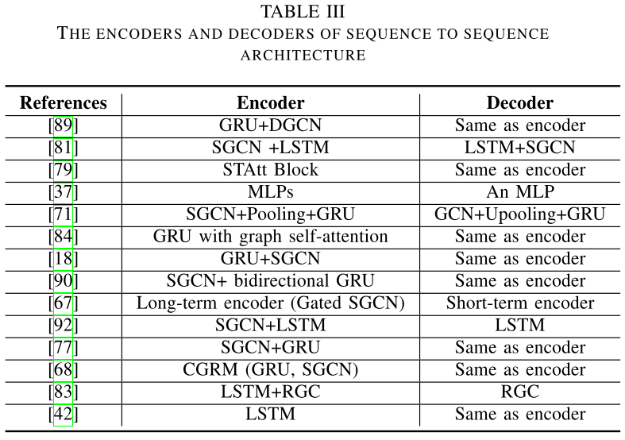

注意，基于RNN的解码器在测试推断期间存在严重的错误累积问题，这是因为每个先前的预测步骤是产生下一步预测的输入。[89]，[84]采用了计划抽样以缓解这一问题。[67]用短期和长期的解码器代替了基于RNNs的解码器，专门用于最后一步的预测，从而简化了错误累积。Seq2Seq技术在流量域中的使用非常灵活，例如[81]将Seq2Seq集成到一个更大的框架中，成为GAN的生成器和鉴别器。

## [GAN](#content)

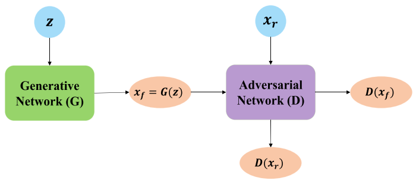

图10.生成对抗网络：生成器G负责从随机向量z生成生成的样本$x_f = G(z)$，该样本从先前的分布$p_z$采样。鉴别器D负责从训练数据中鉴别出从G产生的伪样本$x_f$和真实样本$x_r$。

### [GAN](#content)

生成对抗网络（GAN）[124]是一个强大的深度生成模型，旨在生成与真实对应物尽可能无法区分的人工样本。GAN受博弈论的启发，由两个参与者组成，一个称为生成器G的生成神经网络，一个称为鉴别器D的对抗网络（如图10所示）。

鉴别器D试图确定输入样本是属于生成的数据还是真实数据，而生成器G试图通过产生尽可能真实的样本来欺骗鉴别器D。相互对抗和优化的两个过程经过交替训练，从而增强了D和G的性能。当G生成的假样本非常接近地面真相并且D无法再区分它们时，可以认为是GeneratorG已经了解了真实数据的真实分布，并且模型收敛了。这时，我们可以考虑使该博弈达到纳什均衡。

从数学上讲，可以制定这样的过程以最小化其损失$Loss_G$和$Loss_D$。损失函数是用$f$表示的交叉熵，我们可以得到：
$$
\begin{aligned}
\operatorname{Loss}_{G} &=f(D(G(z)), 1)=-\sum \log D(G(z)) \\
\phi^{*} &=\underset{\phi}{\operatorname{argmin}}\left(\operatorname{Los} s_{G}\right)=\operatorname{argmax}_{\phi}\left(-\operatorname{Los} s_{G}\right) \\
&=\underset{\phi}{\operatorname{argmax}} \mathbb{E}(\log D(G(z)))
\end{aligned} \tag{22}
$$

$$
\begin{aligned}
\operatorname{Loss}_{D} &=f\left(D\left(x_{r}\right), 1, D\left(x_{f}\right), 0\right) \\
&=-\sum \log D\left(x_{r}\right)-\sum \log \left(1-D\left(x_{f}\right)\right) \\
\theta^{*} &=\underset{\theta}{\operatorname{argmin}\left(\operatorname{Loss}_{D}\right)=\operatorname{argmax}}\left(-\operatorname{Los} s_{D}\right) \\
&=\underset{\theta}{\operatorname{argmax}}\left(\mathbb{E}\left(\log D\left(x_{r}\right)+\log \left(1-D\left(x_{f}\right)\right)\right)\right)
\end{aligned} \tag{23}
$$

其中1是真实样本$x_r$的标签。0是假样本$x_f = G(z)$ 的标签。$\phi$和$\theta$ 分别是G和D的可训练参数。请注意，训练G时，D是不可训练的。有兴趣的读者可以参考[125]，[126]。

### [GAN in Traffic Domain](#content)

当将GAN用于交通预测任务[127]，[128]时，通常会使用生成器G根据历史观测值生成未来的交通观测值。然后将生成的数据和将来的实际数据馈入鉴别器D进行训练。训练后，生成器G可以通过大量历史数据来学习实际交通流数据的分布，并可以用来预测未来的交通状态[81]。GAN还可以用于解决交通数据的稀疏性问题，因为它具有处理数据生成的功效[76]。

此外，取决于特定的流量任务，GAN的生成器或判别器可以是任何模型，例如RNN，Seq2Seq。

# [Challenges Perspective](#content)

由于交通网络中区域之间时空的复杂依赖性，许多交通任务非常具有挑战性。另外，外部因素也是提高预测精度的重要因素。在本节中，我们介绍了流量域中的常见挑战。我们会认真研究每个挑战和相应的解决方案，并进行必要的比较。

## [Spatial Dependency](#content)

许多先前的文献[106]，[107]，[129]通过将整个交通网络分解为段或网格，然后采用CNN来处理基于网格的数据来提取空间特征。但是，CNN只能捕获空间局部性，而忽略网络的全局性。更糟糕的是，基于网格的假设实际上违反了交通网络的自然拓扑。因为许多交通网络在物理上都组织成一个图，并且图拓扑信息显然对于交通预测很有用（如图11所示）。因此，图神经网络可以比基于网格的方法更好地模拟交通网络中的空间依赖性。

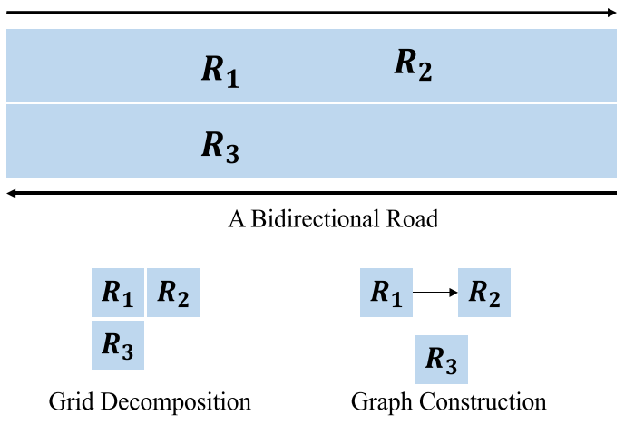

图11.双向道路的公式：道路$R_1$的交通状况仅受同一条道路$R_2$的影响，与对面的道路$R_3$的相关性较弱。但是，如果将该区域建模为网格，则$R_3$对$R_1$的影响与$R_2$相似，这是事实。如果将其建模为图形，则$R_1$与$R_2$连接并且与$R_3$断开连接，这可以反映出真实的关系。

但是，交通网络中的空间依赖性非常复杂，我们将其分为三个空间属性，即空间局部性，多重关系，全局连通性。有几种GNN与其他深度学习技术相结合，可以有效地对不同的空间属性进行建模。

### [Spatial Locality](#content)

空间局部性是指相邻区域通常彼此高度相关。例如，地铁站的客流显然受到其相连站的影响。广泛采用K-localized频谱图卷积网络（SGCN）将0到$K -1$跳邻居的信息聚集到中心区域。但是，有些工作对空间局部性做出了不同的假设，并利用了一些新颖的技巧。

代表交通拓扑的邻接矩阵通常是预先定义的，而[61]，[18]则认为相邻位置之间是动态相关的。他们将注意力机制整合到了SGCN中，以自适应地捕获周围区域之间的动态相关性。

SGCN要求所有区域都具有相同的本地统计信息，并且其卷积内核与位置无关。但是，[60]澄清了交通数据的本地统计信息在不同地区之间的变化，他们自动为不同地区设计了位置相关的内核。

### [Multiple Relationships](#content)

虽然局部性属性着重于空间邻近性，但目标区域可以通过各种非欧几里得关系与远处区域相关联（如图5所示）。例如，功能相似性是指在功能方面，较远的区域与目标区域相似，这可以通过周围的POI来表征[74]，[62]。交通运输的连通性表明，那些地理上相距遥远但交通方便的地方可以相互关联[74]。可达的方式可以是高速公路，普通公路，地铁。[74]使用多个图对这些不同类型的相关性进行编码，并利用多图卷积来显式提取这些相关性信息。[73]采用语义邻居来模拟起点和终点之间的相关性。相关性通过它们之间的客流来衡量。

### [Global Connectivity](#content)

空间邻近性和多关系依赖关系都侧重于网络的某些部分，而忽略了整个结构。全局连通性是指在整个网络范围内，不同区域的流量状况相互影响。在全局范围内开发交通网络的结构信息有几种策略。

捕获全局连通性的一种流行方法是，将流量网络上不断变化的流量条件建模为在网络规模上发生的扩散过程，这由幂级数转换矩阵表示。然后，采用扩散图卷积网络（DGCN）全局提取空间相关性[91]，[89]，[81]，[82]，[77]，[72]。

[85]用路径增长算法设计了一个新颖的空间图池层，以产生一个更粗糙的图。他们将该池层堆叠在SGC层之前，以获得多粒度图卷积，该卷积可以提取各种范围内的空间特征。

[82]提出了一个具有自适应邻接矩阵的SGC层来捕获数据中隐藏的全局空间依赖性。通过端到端有监督的训练从数据中学习该自适应邻接矩阵。

## [Temporal Dependency](#content)

时间依赖性是指某个时间的预测通常与各种历史观测值相关联[74]。

如第四部分所述，许多工作都是通过基于RNN的方法提取时间相关性的。但是，基于RNN的方法存在耗时的迭代过程，并且面临捕获长序列的梯度爆炸/消失问题。因此，一些作品采用基于TCN的方法，具有结构简单，并行计算和稳定梯度的优势[74]，[62]。另外，TCN能够通过堆叠多层来处理不同的时间级别。例如，[93]，[82]堆叠了多个TCN层，底层提取了短期的相邻依赖关系，而高层则学习了长期的时间特征。

### [Multi-timescale](#content)

一些作品从多时间维度的角度提取时间依赖性[61]，[95]。[61]将时间依存关系分解为最近，每日和每周的依存关系。最近的依赖性是指未来的交通状况最近受到交通状况的影响。例如，上午9点的交通拥堵不可避免地会影响接下来几个小时的交通流量。每日依赖度描述了交通数据中重复的每日模式，这是由于人们的日常例行活动，例如早高峰和晚高峰。每周依赖性考虑了由同一周属性引起的影响，例如，所有星期一在短期内共享相似的流量模式。[61]设置三个具有相同结构的并行组件，分别对这三个时间属性进行建模。

### [Different Weights](#content)

一些工作认为，历史和未来观测之间的相关性在不同的先前时间片中是变化的。[61]采用时间注意机制来适应性地重视历史数据。

## [Spatiotemporal Dependency](#content)

许多工作以顺序的方式分别捕获空间和时间依赖性[90]，[81]，[75]，[55]，[87]，[98]，[56]，而空间和时间依赖性紧密地交织在一起。交通数据。[61]认为，在不同时间对不同地点的历史观察对未来中部地区有不同的影响。举一个明显的例子，由于交通堵塞的逐渐形成和扩散，在一个关键道路发生交通事故，会在不同的时间对相关道路造成严重的破坏。

单独建模的局限性在于，空间特征和时间特征之间的潜在相互作用被完全忽略了，这可能会损害预测性能。为了克服这种局限性，一种流行的方法是将图卷积运算（例如SGC，DGC）合并到RNN（如第四部分所述）以共同捕获空间时间相关性[58]，[91]，[89]，[86]，[77]，[72]，[18]，[85]，[68]。

## [External Factors](#content)

除了正常的空间数据和时间数据，还有一些其他类型的数据与交通预测任务高度相关，例如假期，小时/天/周/月/月/季节/年相关属性（例如，工作日和周末）[62]，[95]，天气（例如降雨，温度，空气质量）[95]，特殊事件，POI [74]，交通事故（例如事故发生时间，事故类型）[87]，我们将其称为外部因素或背景因素。请注意，[90]将历史统计速度信息（例如，行车速度的平均值或标准偏差）视为外部因素。

在我们的日常生活中可以观察到一些与外部因素有关的交通现象。例如，商业区域和居民区是具有不同交通流的不同兴趣点（POI）。与正常工作日相比，假期的交通需求有形地增长。暴雨绝对会减少交通量。另外，大规模的音乐会或足球比赛导致交通聚集，影响周围的交通状况。

在外部因素中，离散值（例如天属性，节假日和天气状况）通常通过一键编码转换为二进制矢量，而包括温度，风速在内的连续值则通过Min-Max归一化或Z-score进行缩放。

在我们调查的文献中，有两种方法可以处理外部因素。第一种方法是将外部因素与其他特征串联起来，并将其输入模型[91]，[62]。第二种方法是设计一个仅负责处理外部因素的外部组件。外部组件通常包含两个FC层，其中第一层提取重要特征，第二层将低维特征映射到高维[62]，[87]，[95]，[42]。[92]采用多层LSTM层提取背景因素的表示。外部组件的输出与其他组件融合在一起以生成最终结果。

# [Public Datasets and Open Source Codes](#content)

> 这部分更多内容可以参考：[https://github.com/Knowledge-Precipitation-Tribe/Urban-computing-papers](https://github.com/Knowledge-Precipitation-Tribe/Urban-computing-papers)

## [Public Datasets](#content)

我们在调查中总结了一些公共数据集（如表IV所示），以帮助后继者参与该领域并产生更多有价值的作品。

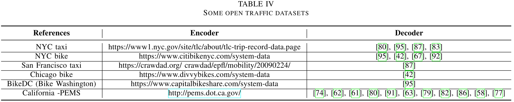

## [Open Source Codes Open-source](#content)

开源实现有助于研究人员比较他们的方法。我们提供了本文回顾的文献的公共源代码的超链接（如表V所示），以促进交通领域的基础实验。

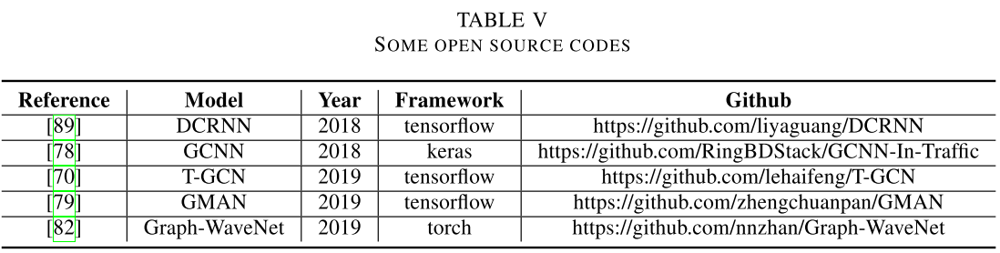

# [Future Directions](#content)

表II概述了我们仔细检查的相关工作。在这些工作的基础上，我们为研究人员提出了进一步探索的方向，可以分为应用相关，技术相关，外部因素相关的方向。

如表II所示，有许多利用基于图的深度学习体系结构来解决交通状态预测和交通需求预测的工作，这些技术已经达到了最先进的性能。然而，只有少数工作在其他研究方向上以图形角度分析交通数据，例如驾驶员行为分类[55]，最佳DETC方案[49]，车辆/人的轨迹预测[56]，[57]，路径可用性[58]，交通信号控制[59]。当涉及交通事故检测，车辆检测时，采用基于图的深度学习技术的工作很少。就我们而言，我们找不到任何一个。因此，即将参加的参与者可以在图形视图上探索这些方向，并从现有作品中学习成功的经验。

现有的大多数工作都使用频谱图卷积网络（SGCN）和扩散图卷积网络（DGCN）这两种流行的GNN，来分析相关的交通任务。流量域中的图注意力网络（GAT）[130]很少[79]，[84]，[88]，[97]。其他种类的GNN，例如图自动编码器（GAE）[131]，[132]，递归图神经网络（RecGNN）[133]在其他领域都达到了最先进的性能，但很少探索到目前为止的交通任务。因此，值得将这些GNN扩展到流量域。另外，大多数基于图的交通工作都是回归任务，而只有[58]，[55]是分类任务。研究人员可以从图的角度探索分类交通任务。

最后，许多现有的流量模型没有考虑外部因素，因为外部因素很难收集，量化并具有各种数据格式。外部因素的稀疏性仍然是研究界面临的挑战。另外，处理外部因素的技术还很幼稚，例如，一个简单的完全连接的层。应该有更多的方法来收集和处理外部因素。

# [CONCLUSION](#content)

在本次调查中，我们对交通工程中各种基于图的深度学习架构进行了全面回顾。更具体地说，我们总结了基于一般图形的交通问题公式，以及从各种交通数据集中构造图形的方法。此外，我们分解所有研究的架构，并分析它们共享的通用模块，包括图神经网络（GNN），递归神经网络（RNN），时间卷积网络（TCN），序列到序列（Seq2Seq）模型，生成对抗性网络（GAN）。我们对交通任务中的变量进行了详尽的描述，希望为即将到来的研究人员提供有关如何为自己的交通任务设计新颖技术的见解。我们还总结了许多交通场景中的常见挑战，例如空间依赖性，时间依赖性，外部因素。不仅如此，我们针对每种挑战提供了多种基于深度学习的解决方案。此外，我们在相关著作中提供了一些公共数据集和代码的超链接，以方便即将进行的研究。最后，我们为对此领域感兴趣的参与者提出了一些未来的方向。